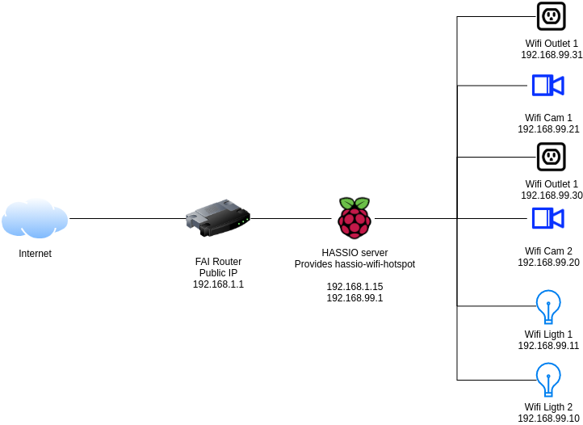

# hassio-wifi-hotspot

Create an autonomous home automation system.

Connect directly your wifi sensors / cams / lights / outlets to hassio for a perfect device isolation.

With this solution, your device will be in an isolated network without internet access but proxfied by your hassio. 

Perfect for a first low cost installation in a small house, apartment or shed. 

### Sample of network Architecture




## Installation

For installation read [the official instructions](https://www.home-assistant.io/hassio/installing_third_party_addons/) on the Home Assistant website my github url :

```txt
https://github.com/ldrago/my-hassio-addons
```

### Sample of valid configuration

The available configuration options are as follows (this is filled in with some example data):

```
{
    "ssid": "MY_HASSI_WIFI",
    "wpa_passphrase": "SECURED_WPA_PASS",
    "channel": "6",
    "network": "192.168.99.0",
    "address": "192.168.99.1",
    "netmask": "255.255.255.0",
    "broadcast": "192.168.99.255",
    "fixed_ips": [{
      "name": "outlet1",
      "mac_address": "00:00:00:00:00",
      "ip": "192.168.99.10"
    },
    {
      "name": "Cam1",
      "mac_address": "F4:00:D6:00:00",
      "ip": "192.168.99.12"
    }]
}
```
